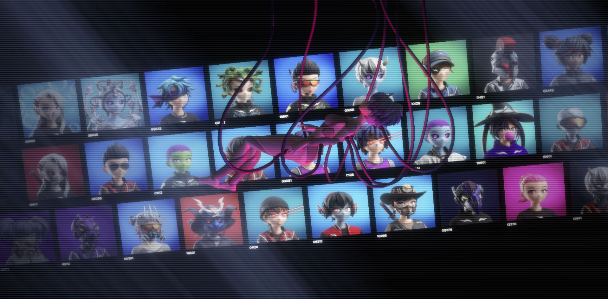

<a name="readme-top"></a>

[![LinkedIn][linkedin-shield]][linkedin-url]

<br />
<div align="center">
  <a href="https://clonex-explorer.vercel.app/">
    
  </a>

  <h3 align="center">CloneX Explorer: Navigating the Future of Digital Art</h3>

  <p align="center">
    An interactive platform for exploring the CloneX NFT collection.
    <br />
    <a href="https://clonex-explorer.vercel.app/">View Demo</a>
    ·
    <a href="https://github.com/vinnyhoward/clonex-explorer/issues">Report Bug</a>
    ·
    <a href="https://github.com/vinnyhoward/clonex-explorer/issues">Request Feature</a>
  </p>
</div>

<details>
  <summary>Table of Contents</summary>
  <ol>
    <li><a href="#about-the-project">About The Project</a></li>
    <li><a href="#built-with">Built With</a></li>
    <li><a href="#getting-started">Getting Started</a></li>
    <li><a href="#usage">Usage</a></li>
    <li><a href="#license">License</a></li>
    <li><a href="#contact">Contact</a></li>
    <li><a href="#links">Links</a></li>
  </ol>
</details>

## About The Project

[![CloneX Explorer Screen Shot][figma-screenshot]](/assets/clonex_explorer_image.png)
For a detailed view of the design, visit the [Figma project](https://www.figma.com/file/bL1mN9OJdwcRUPCVwtXRi6/Clone-Asset-Explorer?type=design&node-id=194%3A130&mode=design&t=AoqYcLsU2gA7ElgX-1).

Explore the rich universe of CloneX NFTs with an intuitive and visually engaging interface. CloneX Explorer makes it easy to browse, search, and analyze CloneX collection NFTs in real-time. Visit the [subgraph](https://github.com/vinnyhoward/clonex-subgraph) to see how it happens

### Built With

* [![Next][Next.js]][Next-url] A React framework for production, providing server-side rendering and generating static websites.

* [![Apollo][Apollo]][apollo-url] A comprehensive state management library for JavaScript that enables you to manage both local and remote data with GraphQL.

* [![Prisma][Prisma]][prisma-url] Next-generation ORM for Node.js and TypeScript, making database access easy with an auto-generated query builder for TypeScript & Node.js.

* [![Graphql][Graphql]][graphql-url] A query language for your API, and a server-side runtime for executing queries by using a type system you define for your data.

* [![Styled-components][Styled-components]][styled-components-url] Enhances CSS for styling React component systems.

- **GSAP (GreenSock Animation Platform):** Professional-grade animation for the modern web.

<p align="right">(<a href="#readme-top">back to top</a>)</p>

## Getting Started

To get a local copy up and running follow these simple steps.

### Prerequisites

This project requires Node.js to run. Download and install it from [nodejs.org](https://nodejs.org/), if you haven't already.

### Installation

1. Clone the repository:

```sh
git clone https://github.com/vinnyhoward/clonex-explorer.git
cd clonex-explorer
```

1. Install NPM packages:

```sh
npm install
```

2. Set up your environment variables:
Create a .env file in the root directory of your project. Add the following configurations:

```sh
NEXT_PUBLIC_SUBGRAPH_ENDPOINT=your_subgraph_endpoint_here
POSTGRES_PRISMA_URL=your_database_url_here
POSTGRES_URL_NON_POOLING=your_database_url_for_non_pooling_connections
```

3. Start the development server:

```sh
npm run dev
```

Navigate to http://localhost:3000 to view the application.

<p align="right">(<a href="#readme-top">back to top</a>)</p>

## Usage

CloneX Explorer offers a wide range of functionalities designed to enhance your experience with the CloneX NFT collection. Here's how you can make the most out of our platform:

- **Dynamic Searching & Filtering**: Easily search for specific CloneX NFTs using various filters such as rarity, price range, and traits. Our intuitive interface allows for a seamless exploration experience.

- **Interactive NFT Galleries**: View high-resolution images of CloneX NFTs in our interactive galleries. Click on any NFT to uncover detailed information, including its provenance, current owner, and transaction history.


<p align="right">(<a href="#readme-top">back to top</a>)</p>

### License
Distributed under the MIT License. See LICENSE for more information.

<p align="right">(<a href="#readme-top">back to top</a>)</p>

## Contact

Vincent Howard - [@NiftyDeveloper](https://twitter.com/NiftyDeveloper) - vincenguyenhoward@gmail.com

Project Link: [https://github.com/vinnyhoward/clonex-subgraph](https://github.com/vinnyhoward/clonex-subgraph)

<p align="right">(<a href="#readme-top">back to top</a>)</p>

## Links
- Project: https://rtfkt.com
- Token URI: https://clonex-assets.rtfkt.com/
- Contract Address: `0x49cF6f5d44E70224e2E23fDcdd2C053F30aDA28B`


[contributors-shield]: https://img.shields.io/github/contributors/othneildrew/Best-README-Template.svg?style=for-the-badge
[contributors-url]: https://github.com/othneildrew/Best-README-Template/graphs/contributors
[forks-shield]: https://img.shields.io/github/forks/othneildrew/Best-README-Template.svg?style=for-the-badge
[forks-url]: https://github.com/othneildrew/Best-README-Template/network/members
[stars-shield]: https://img.shields.io/github/stars/othneildrew/Best-README-Template.svg?style=for-the-badge
[stars-url]: https://github.com/othneildrew/Best-README-Template/stargazers
[issues-shield]: https://img.shields.io/github/issues/othneildrew/Best-README-Template.svg?style=for-the-badge
[issues-url]: https://github.com/othneildrew/Best-README-Template/issues
[license-shield]: https://img.shields.io/github/license/othneildrew/Best-README-Template.svg?style=for-the-badge
[license-url]: https://github.com/othneildrew/Best-README-Template/blob/master/LICENSE.txt
[linkedin-shield]: https://img.shields.io/badge/-LinkedIn-black.svg?style=for-the-badge&logo=linkedin&colorB=555
[linkedin-url]: https://www.linkedin.com/in/vinnyhoward/
[product-screenshot]: public/images/product_image.png
[figma-screenshot]: assets/images/product_image.png
[Next.js]: https://img.shields.io/badge/next.js-000000?style=for-the-badge&logo=nextdotjs&logoColor=white
[Next-url]: https://nextjs.org/
[React.js]: https://img.shields.io/badge/React-20232A?style=for-the-badge&logo=react&logoColor=61DAFB
[React-url]: https://reactjs.org/
[Vue.js]: https://img.shields.io/badge/Vue.js-35495E?style=for-the-badge&logo=vuedotjs&logoColor=4FC08D
[Vue-url]: https://vuejs.org/
[Angular.io]: https://img.shields.io/badge/Angular-DD0031?style=for-the-badge&logo=angular&logoColor=white
[Angular-url]: https://angular.io/
[Svelte.dev]: https://img.shields.io/badge/Svelte-4A4A55?style=for-the-badge&logo=svelte&logoColor=FF3E00
[Svelte-url]: https://svelte.dev/
[Laravel.com]: https://img.shields.io/badge/Laravel-FF2D20?style=for-the-badge&logo=laravel&logoColor=white
[Laravel-url]: https://laravel.com
[Bootstrap.com]: https://img.shields.io/badge/Bootstrap-563D7C?style=for-the-badge&logo=bootstrap&logoColor=white
[Bootstrap-url]: https://getbootstrap.com
[JQuery.com]: https://img.shields.io/badge/jQuery-0769AD?style=for-the-badge&logo=jquery&logoColor=white
[JQuery-url]: https://jquery.com 
[Vite.js]: https://img.shields.io/badge/vite-%23646CFF.svg?style=for-the-badge&logo=vite&logoColor=white
[vite-url ]: https://vitejs.dev/
[Typescript]: https://img.shields.io/badge/typescript-%23007ACC.svg?style=for-the-badge&logo=typescript&logoColor=white
[ts-url ]: https://www.typescriptlang.org/
[Three.js]: https://img.shields.io/badge/threejs-black?style=for-the-badge&logo=three.js&logoColor=white
[three-url]: https://threejs.org/
[bun-url]: https://bun.sh/
[Bun.js]: https://img.shields.io/badge/bun-282a36?style=for-the-badge&logo=bun&logoColor=fbf0df
[Sanity.io]: https://img.shields.io/badge/Sanity.io-black?style=for-the-badge&logo=sanity&logoColor=white
[sanity-url]: https://www.sanity.io/
[Prisma]: https://img.shields.io/badge/Prisma-3982CE?style=for-the-badge&logo=Prisma&logoColor=white
[prisma-url]: http://prisma.io
[Postgres]: https://img.shields.io/badge/PostgreSQL-316192?style=for-the-badge&logo=postgresql&logoColor=white
[postgres-url]: https://www.postgresql.org/

[Apollo]: https://img.shields.io/badge/Apollo%20GraphQL-311C87?&style=for-the-badge&logo=Apollo%20GraphQL&logoColor=white
[apollo-url]: https://www.apollographql.com/

[GraphQL]: https://img.shields.io/badge/GraphQl-E10098?style=for-the-badge&logo=graphql&logoColor=white
[graphql-url]: https://graphql.org/

[Styled-components]: https://img.shields.io/badge/styled--components-DB7093?style=for-the-badge&logo=styled-components&logoColor=white
[styled-components-url]: https://styled-components.com/

